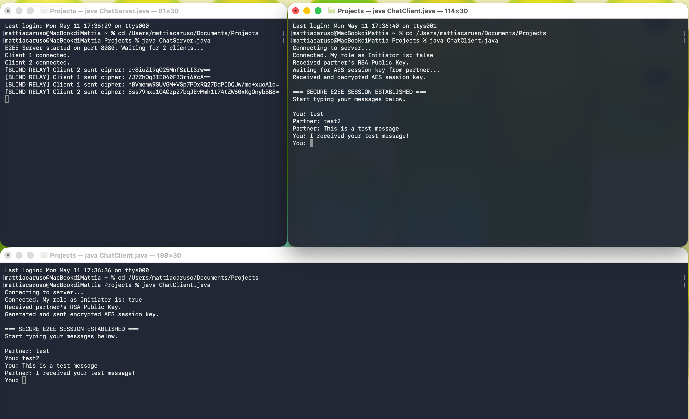

# 🔒 End-to-End Encrypted (E2EE) Java Chat Protocol

A custom-built, multi-threaded client-server chat application implementing End-to-End Encryption from scratch using Java's built-in networking and cryptography libraries. 

Most modern chat applications rely on pre-built secure sockets (like TLS/SSL). This project bypasses standard secure sockets to manually implement a **Hybrid Encryption Protocol** (RSA + AES) over raw TCP sockets. The goal of this project is to demonstrate a deep, low-level understanding of applied cryptography, network programming, and object-oriented design.

## Key Features

*   **Custom Hybrid Encryption Protocol:** Uses 2048-bit RSA for the initial secure handshake and 256-bit AES for high-speed message encryption.
*   **"Blind" Relay Server:** The server only routes packets. It cannot read the message contents or the AES session keys, ensuring true Zero-Knowledge/E2EE architecture.
*   **Multi-threaded Architecture:** The server concurrently handles multiple clients without blocking I/O threads.
*   **Zero Dependencies:** Built entirely with pure Java (`java.net`, `java.security`, `javax.crypto`).

  

---

## How the Cryptography Works (The Handshake)

Asymmetric encryption (RSA) is highly secure but mathematically slow and strictly limited by data size, making it terrible for continuous chat. Symmetric encryption (AES) is lightning-fast but requires both parties to safely share the exact same key.

This application uses a **Hybrid Approach**, mimicking how protocols like Signal and modern HTTPS operate:

1.  **RSA Key Generation:** When Alice and Bob start their clients, they locally generate their own RSA Public/Private key pairs.
2.  **Public Key Exchange:** Alice and Bob send their RSA *Public Keys* to each other through the server in plain text.
3.  **AES Session Key Generation:** The designated "Initiator" (Alice) generates a secure, random 256-bit AES Session Key.
4.  **Secure Key Transfer:** Alice encrypts this AES key using *Bob's RSA Public Key* and sends it across the network. 
5.  **Decryption & Lock:** Bob receives the encrypted packet and uses his *RSA Private Key* to decrypt it. 
6.  **Encrypted Tunnel:** Both clients now share the same AES key. All subsequent chat messages are encrypted using AES, resulting in unreadable Base64 ciphertext for anyone listening on the network (including the server).

---

## Tech Stack
*   **Language:** Java (JDK 17+)
*   **Networking:** `java.net.Socket`, `java.net.ServerSocket`, `ObjectInputStream`/`ObjectOutputStream`
*   **Cryptography:** `java.security.KeyPairGenerator`, `javax.crypto.Cipher`, `javax.crypto.KeyGenerator`

---

## How to Run the Application

### Prerequisites
You must have the Java Development Kit (JDK) installed on your machine.
Verify your installation by running: `java -version`

### 1. Compile the Code
Navigate to the project directory in your terminal and compile all Java files:
```bash
javac *.java
